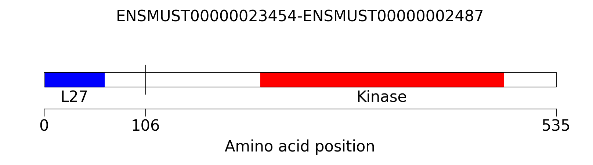

Examples
===========

Here are some examples that demonstrate the different features of AGFusion

Basic usage
-----------

For basic usage of AGFusion from the command line you need to provide the
5' and 3' gene fusion partners (gene symbol or Ensembl gene ID), their
respective fusion junction coordinates, the reference genome, and the
output directory. Here is a simple example of a DLG1-BRAF fusion::

    agfusion \
      --gene5prime DLG1 \
      --gene3prime ENSMUSG00000002413 \
      --junction5prime 31684294 \
      --junction3prime 39648486 \
      --genome GRCm38 \
      --out DLG1-BRAF

.. image:: ENSMUST00000132176-ENSMUST00000002487.png
    :align: center

Specify different domain names or colors
----------------------------------------

You can change the domain names and colors with the colors and rename
flags. Simply provide a space-delimited list of paired entries separated by a
semicolon. For color you can either specify a typical color name (e.g. black,
blue, etc...) or a hex code.::

    agfusion \
      --gene5prime ENSMUSG00000022770 \
      --gene3prime ENSMUSG00000002413 \
      --junction5prime 31684294 \
      --junction3prime 39648486 \
      --genome GRCm38 \
      --out DLG1-BRAF \
      --colors Pkinase_Tyr:red L27_1:#00cc00 \
      --rename Pkinase_Tyr:Kinase L27_1:L27

.. image:: ENSMUST00000132176-ENSMUST00000002487-color.png
    :align: center

Rescale the protein
-------------------

You can rescale the protein length through the scale paramter so that images of
two different fusions have appropriate relative lengths when plotted side by
side. In this example the width of the figure is set to 2000 amino acids::

    agfusion \
      --gene5prime ENSMUSG00000022770 \
      --gene3prime ENSMUSG00000002413 \
      --junction5prime 31684294 \
      --junction3prime 39648486 \
      --genome GRCm38 \
      --out DLG1-BRAF \
      --scale 2000

    agfusion \
      --gene5prime FGFR2 \
      --gene3prime DNM3 \
      --junction5prime 130167703 \
      --junction3prime 162019992 \
      --genome GRCm38 \
      --out FGFR2-DNM3 \
      --scale 2000

.. image:: ENSMUST00000132176-ENSMUST00000002487-scale.png
    :align: center
.. image:: ENSMUST00000120187-ENSMUST00000086074.png
    :align: center

Image customization
-------------------

You can specify DPI, font size, and image size (in inches) through the dpi, fontsize,
width, and height flags::

    agfusion \
      --gene5prime ENSMUSG00000022770 \
      --gene3prime ENSMUSG00000002413 \
      --junction5prime 31684294 \
      --junction3prime 39648486 \
      --genome GRCm38 \
      --out DLG1-BRAF \
      --colors Pkinase_Tyr:red \
      --rename Pkinase_Tyr:Kinase \
      --fontsize 12 \
      --dpi 350 \
      --height 2 \
      --width 8

